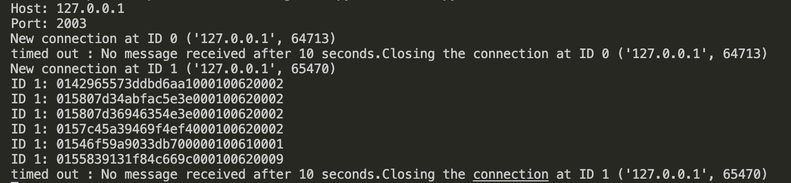
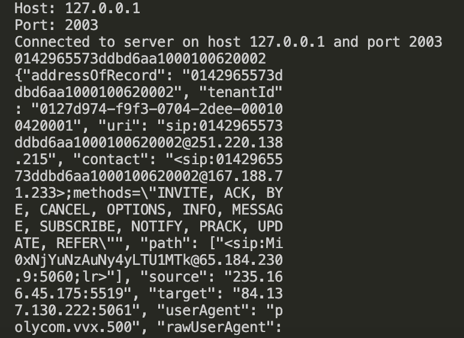

# TCP Server Client Connection


# Functinality

Application contains following steps
<li>Server read the AOR record file</li>
<li>Server can connect multiple clients</li>
<li>Client can send request with AOR number and if       number matches with the given AOR number then server return matched AOR JSON data one at a time other wise server returns empty line</li>
<li>If server does not receive any record within 10 sec from client then connect will get closed by server</li>

# Running the Application locally
1. Clone the reponsitory
   ```
   git clone https://github.com/aartigoswami91/goto
   ```

3. run the server
   ```
   python server.py
   ```
   


4. run client
   ```
      python client.py
   ```
   

5. It will show the confirmation message server has connected

6. Next step ask user to enter AOR
   
7. If record matches with the given AOR, it will return the record related to the AOR otherwise server will return empty line.
   
8. server will close the connection if server does not recieve any request within 10 sec.

   
